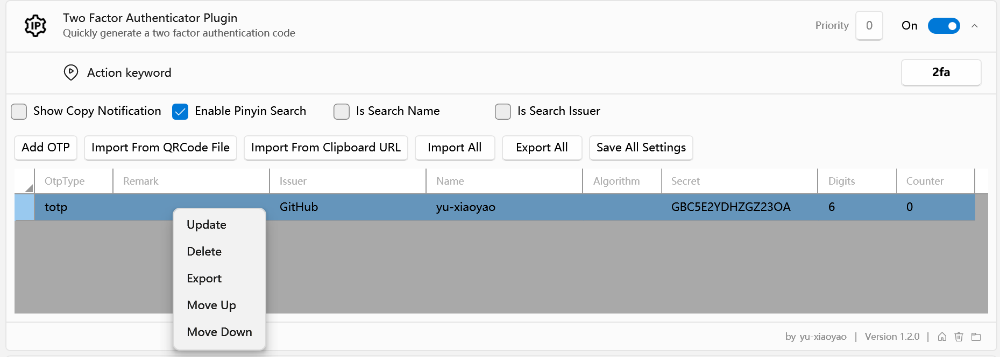

Flow.Launcher.Plugin.TwoFactorAuthenticator
==================
[TOC]


A Two Factor Authenticator Code Generator for the [Flow launcher](https://github.com/Flow-Launcher/Flow.Launcher).

# Two Factor Authenticator

## Support OTP Type

- [x] TOTP
- [ ] HOTP. (Not support yet)

## Import Support Schema

1. otpauth://
2. otpauth-migration:// : Google Authenticator App Shared URL


## Settings


### CheckBox Settings

- `Show Copy Notification`: Show a notification when the code is copied to the clipboard.
- `Enable Pinyin Search`: When Use Chinese, enable Pinyin search. 中文接音搜索.
- `Is Search Name`: Is Filter by Name Column.
- `Is Search Issuer`: Is Filter by Issuer Column.

### Import
1. Import From Image
2. Import From Clipboard

#### Support OTP URL Schema
1. otpauth://
2. otpauth-migration:// : Google Authenticator App Shared URL

### Add OTP


### Edit OTP
1. Select Edit Item

2. Open Context Menu, and Select Edit


## Usage
```
    2fa <arguments>
```


**Input Filter:**


### Copy Code
> Select Item Press `Enter` or `Click` to Copy Code

### Preview Panel


### Context Menu


## Google Protobuf for OTP Migration URL Protocol

> custom Generate Migration.cs file

```shell
protoc --csharp_out=./Migration Migration/migration.proto
```